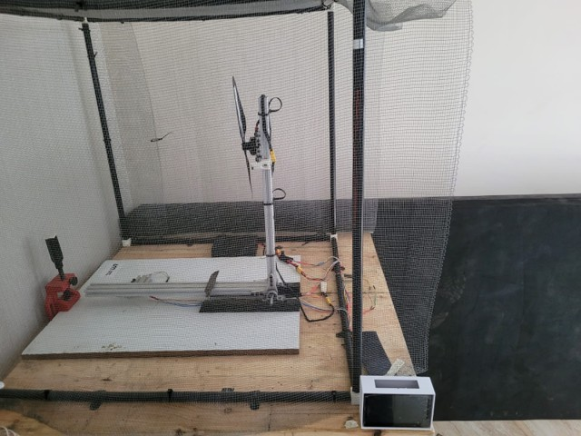

# Propulsion Testing Rig

A customizable and scalable **propulsion testing rig** designed to test and analyze drone propulsion components such as **motors**, **propellers**, **ESCs**, and **batteries** in real-time. Developed as part of an internship project at [UrbanMatrix Technologies] under the mentorship of Prof. V.K. Gupta, IIITDM Jabalpur.

---

## 🚀 Objective

The primary aim is to develop a test rig that:
- Measures **real-time thrust, voltage, current**, and **temperature**.
- Helps identify component faults through **benchmarking and diagnostics**.
- Provides flexibility through a **custom-built, modifiable platform**.
- Improves drone reliability and safety with better **thermal monitoring**.

---

## 📦 Features

- **Sensor Integration**
  - Load Cell (SPI) – Thrust measurement
  - MLX90614 IR Temperature Sensor (I2C)
  - Thermistor (via Arduino -> SPI)
  - Power Module (I2C) – Voltage & current
- **Data Logging & Visualization**
  - Python scripts for logging on Raspberry Pi
  - Visualization: Thrust vs Power, Voltage vs Current, etc.
- **User-Friendly Interface**
  - Touchscreen-based GUI for manual & automated testing
- **Component Testing Capabilities**
  - Supports propellers up to 21”
  - Motor mount size up to 3cm
  - Current range: 0–40A
  - RPM up to 25,000

---

## 🛠️ Technologies Used

- Python (sensor integration, data logging)
- Raspberry Pi + Arduino (hardware interfacing)
- Fusion 360 (CAD modeling)
- CNC Machining (aluminum & carbon fiber components)
- SPI & I2C communication protocols
- Shell scripting (automation on Raspberry Pi)

---

## 🧪 Applications

- Flight time optimization
- Vibration and noise testing
- Thermal performance and diagnostics
- Preventative maintenance
- Payload vs performance benchmarking
- Quality assurance & replication of flight conditions

---

## 📚 Documentation

- 📄 [View Documentation (PDF)](documentation.pdf)
- Rig (Image) 
- GUI (Image) 

